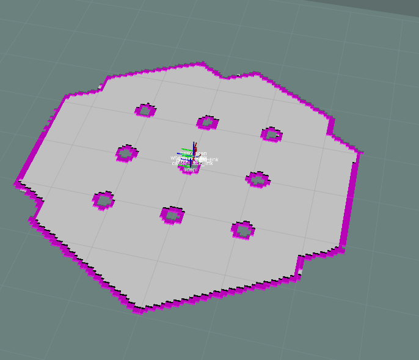
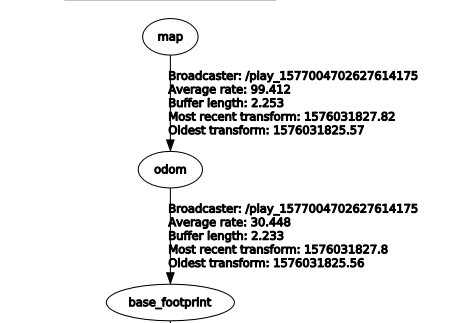

# ros-local-map-builder

## Overview



This package is similar package with [costmap_2d](http://wiki.ros.org/costmap_2d). It provides extracting local map of 'base_link' frame from global map by using ros tf transform.  
But It also provide `odom` method. This method has no limitation with timestamp and more fast.

## Installation

Dependency  

```
$ sudo apt-get install ros-kinetic-map-server ros-kinetic-nav-msgs ros-kinetic-geometry-msgs
```

```
$ cd {your work space}
$ git clone https://github.com/msc9533/ros-local-map-publisher.git
$ catkin_make
```

## Usage

- It provide sample bag file to test package. To run this package with samplebag,

```
$ roslaunch local_map_builder test_with_bag.launch
```

- To run package with your own robot or own bag file,

```
$ roslaunch local_map_builder test.launch
```


## Configuration

```
source_frame: "/map"
child_frame: "/base_link"
map_topic: "/map"
method: "odom" # tf or odom only
odom_topic: "/odom"
cost_map: true
pointcloud_topic: "/pcl"
global_map_static: true
map_size: [5.0, 5.0] #x,y (meter)
tolerance: 0.3 #tolerance of tf transform
cost: 0.2
```

- `source_frame : "/map"` frame of global map topic. normally `/map`.
- `child_frame : "/base_link"` frame of local map. normally `/base_link`.
- `map_topic : "/map"` if map topic is publishing, you should fill out this configuration.
- `method : "tf"` "tf" or "odom" method.
- `cost_map : true` using cost map or not.
- `pointcloud_topic : /scan` if cost map configuration is true, fill out the name of pointcloud
- `global_map_static: true` if map is served by `map_server` ros package, this configuration should be "true".
- `map_size : [5.0 5.0]` size of map. The map that is made is created by the '+- meter' origin of the robot.
- `tolerance: 0.3` tolerance of tf transform
- `cost: 0.2` : Indicates the distance to be marked as non-driveable space from the obstacle.

### Configuration of `tf` Method

When using the tf method, make sure that it is set as follows,



[tf_tutorials](http://wiki.ros.org/tf/Tutorials)

### Configuration of `odom` Method

when using `odom` method, the frame of odometry must be the same as the frame of global map.

TODO

### Configuration of cost map

TODO.

### Configuration of `combined` Method

TODO.