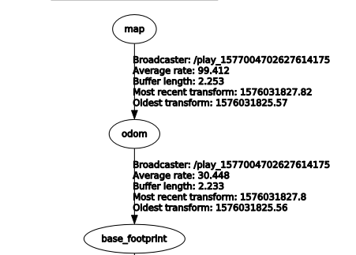

# ros-local-map-builder

## Overview


[costmap_2d](http://wiki.ros.org/costmap_2d)와 비슷한 기능을 하는 패키지 입니다. ros tf tranform을 이용한 global map에서 base_link frame의 local map을 추출하는 기능을 제공합니다. 
하지만 `costmap_2d` 패키지와 달리 `odom`을 이용한 방식을 제공합니다. 이 방식은 `tf`와 달리 시간에 대한 제약을 받지 않습니다.  

## Installation

Dependency  

```
$ sudo apt-get install ros-kinetic-map-server ros-kinetic-nav-msgs ros-kinetic-geometry-msgs
```

```
$ cd {your work space}
$ git clone https://github.com/msc9533/ros-local-map-publisher.git
$ catkin_make
```

## Usage

- 패키지를 확인하기 위한 sample bag을 제공합니다. 제공된 sample bag으로 패키지를 실행합니다.

```
$ roslaunch local_map_builder test_with_bag.launch
```

- bag이 아닌 자신의 환경에서 이 패키지를 활용하고자 할때는 아래의 명령줄을 이용합니다.

```
$ roslaunch local_map_builder test.launch
```

## Configuration

```
source_frame: "/map"
child_frame: "/base_link"
map_topic: "/map"
method: "odom" # tf or odom only
odom_topic: "/odom"
cost_map: true
pointcloud_topic: "/pcl"
global_map_static: true
map_size: [5.0, 5.0] #x,y (meter)
tolerance: 0.3 #tf 방식을 이용할때 설정하는 시간오차입니다.
cost: 0.2
```

- `source_frame : "/map"`global map이 publish되고 있는 프레임입니다. 보통 `/map`으로 되어 있습니다.
- `child_frame : "/base_link"`local_map 이 publish되어야 할 프레임입니다. 보통`/base_link`를 씁니다.
- `map_topic : "/map"`map_server를 이용한 static_map이 아닌 map이 publish되고 있는 경우를 위한 topic이름입니다.  
- `method : "tf"` `tf` 방법, `odom`방법 두가지중 하나를 사용합니다.
- `cost_map : true`laser scan을 이용한 cost_map의 기능을 on/off합니다.
- `pointcloud_topic : /scan`cost map을 표시할 point cloud의 topic이름입니다. 3D pointcloud일 경우 z축은 무시됩니다.
- `global_map_static: true` map_server 를 이용한 static map을 사용할 경우 true, publish되는 topic일 경우 false를 입력 합니다.
- `map_size : [5.0 5.0]` map size를 입력합니다. 만들어지는 map은 로봇의 원점 기준으로 +-meter만큼 생성됩니다.
- `tolerance: 0.3` tf 방법을 사용할 경우 허용되는 시간 오차입니다.
- `cost: 0.2` : 장애물으로부터 주행 불가능할 공간으로 표시될 거리를 나타냅니다.

### Configuration of `tf` Method

tf 방법을 사용할때는 다음과 같이 설정되어 있는것을 확인하여야 합니다.



[tf_tutorials](http://wiki.ros.org/tf/Tutorials)

### Configuration of `odom` Method

`odom` 방법을 사용할때는 publish되고 있는 odometry의 frame이 global map의 frame과 같아야 합니다.

- 내용추가예정.

### Configuration of cost map

추가예정.

### Configuration of `combined` Method

추가예정.